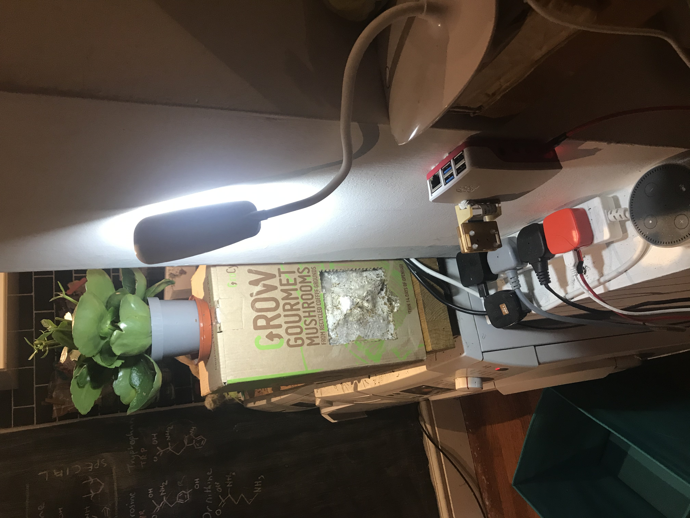

# Somewhat-Smart-Home
Integrating the Raspberry pi across the house!

This repo contains several projects and supercedes others:

* [https://github.com/matteoferla/Temperature-moniting-website-via-Rasberry-Pi](https://github.com/matteoferla/Temperature-moniting-website-via-Rasberry-Pi)
* [https://github.com/matteoferla/Raspberry-Pi-irrigator](https://github.com/matteoferla/Raspberry-Pi-irrigator) —actually the latter still contains a lot of useful info

Some of the following folders have a `README.md` and `setup.py` as if they were separate repos.
The reason for having a single repo is that I don't really want to flood my GitHub with hobby projects and
there are tons of snippets, which I can dump here.

## Set-up

> See [setup](setting_up.md)

There are a few things I do on every Pi:

* Make a file saying who the Pi is
* Install Jupyter notebook and make it run at start-up
* Slack message of it's IP address
* etc.

## Furby

The Furby project got moved to its own repo: [matteoferla/pyfurby](https://github.com/matteoferla/pyfurby).

## Homesensing

This has two parts.

* Miscellaneous Raspberry Pis across the house with different sensors
* A webserver Raspberry Pi (Pi 2) that receives the measurements and serves them

> See [homesensing app project](homesensing%20app%20project/README.md) for website
> See [homesensing api project](homesensing%20api%20project/README.md) for API to upload data
> See [scheduled recording project](scheduled%20recording%20project/README.md) to make the scheduled sensing task

## Webservers

> TODO See LINK TO REPOS

My main webservers are actually on a different Pi namely, a Pi 4.
However, I do not want to stress too much even if it's 4 GB.
Furthermore, I do not want to use the GPIO (well, bar for the fan as it gets rather hot)
because shorting will reset the Pi and Ubuntu x64 is a pain with the GPIO.

## Other

The module photologger takes photos, but can stack in the case of low light — a LED however is always a better solution.

